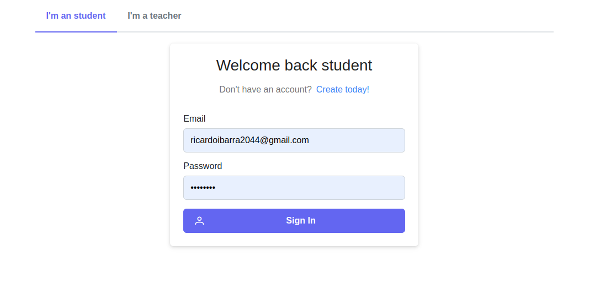
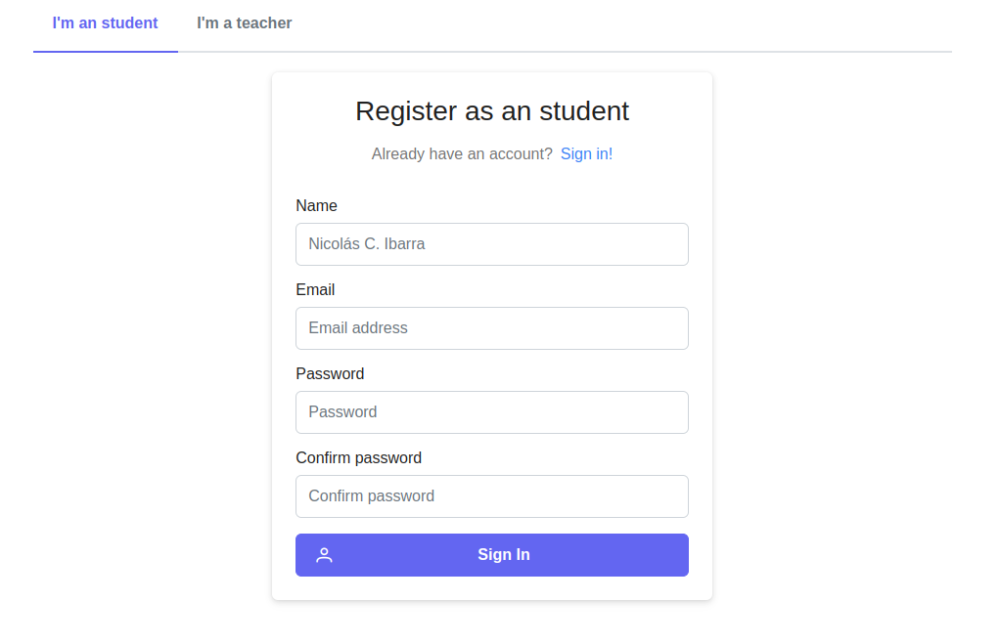
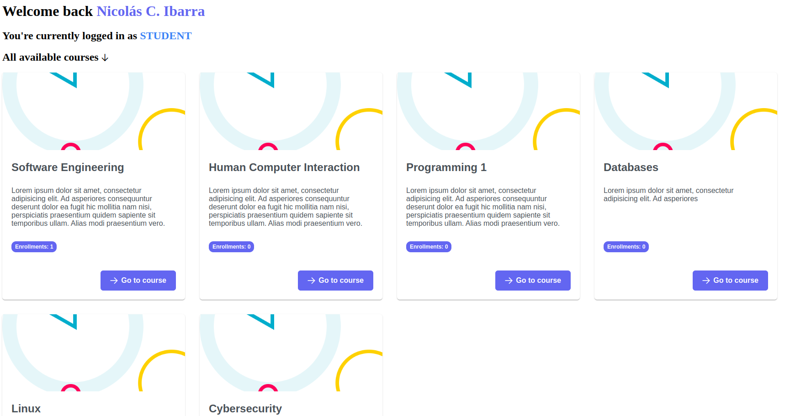
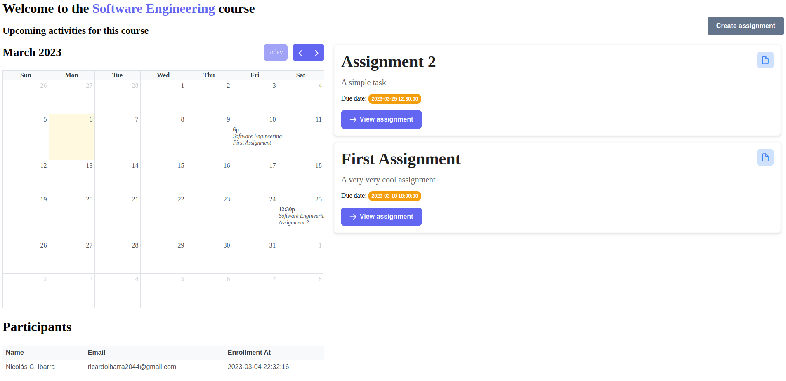

# About

Este proyecto trató de ser una imitación de la popular plataforma de e-learning
**Moodle**, pero con un enfoque muchísimo más simple, pero que trata de mantener
la esencia principal de la plataforma original. En términos de funcionalidad,
este proyecto abarcó las siguientes características:

- Registro de estudiantes y profesores.
- Creación de cursos.
- Creación de tareas.
- Inscripción de estudiantes en cursos.
- Calendario de visualización de tareas.
- Subida de archivos.
- Calificación de tareas por profesores.

# Runtime

El proyecto usa Payara Server 6 Community corriendo en JDK 17.

# Installation

## Database (MySQL)

Para iniciar la base de datos con docker, se puede usar el siguiente comando:

```bash
docker compose up --build
```

Esto iniciará un contenedor de MySQL con la base de datos `moodle_ripoff` y un
contenedor de PHPMyAdmin para administrar la base de datos. PHPMyAdmin estará
ejecutándose en el puerto 80.

## Backend

Para iniciar el backend, se puede usar el siguiente comando:

```bash
mvn clean package payara-micro:start
```

Es importante que la base de datos esté corriendo antes de iniciar el backend.

## Frontend

Para iniciar el frontend, es necesario tener instalado `node 18` y `yarn`.:

```bash
cd src/frontend
yarn install
yarn dev
```

- El login estará disponible en http://localhost:3000/login
- El dashboard de los cursos estará disponible en http://localhost:3000/courses
- El dashboard de un curso estará disponible
  en http://localhost:3000/courses/:id

# Estructura del proyecto

El backend del proyecto está estructurado en 3 capas: **repository**, **service
** y **web**.

- **me.hikingcarrot7.moodleripoff.repository**: Esta capa se encarga de la
  comunicación con la base de datos. En este proyecto, se usó MySQL como base de
  datos.

- **me.hikingcarrot7.moodleripoff.service**: Esta capa se encarga de la lógica
  de negocio y se comunica con la capa `repository` para el acceso a las
  entidades.

- **me.hikingcarrot7.moodleripoff.web**: Esta capa expone los servicios por
  medio de una REST(less) API, y se comunica con la capa `service`. Esta capa
  también se encarga de validar los datos de entrada con el uso de la
  especificación **jakarta.validation**. De igual forma, esta capa se encarga de
  la autenticación y autorización de los usuarios.

El frontend del proyecto se encuentra en la carpeta `src/frontend` y está hecho
con **React** y **Next.js**. Desafortunadamente, no se pudo terminar a tiempo,
pero es logró hacer un prototipo que representa la intención del proyecto. El
frontend consume la API expuesta por la capa `web` del backend
utilizando `axios`.

## Login y registro

La API está protegida por medio de JWT, por lo que es necesario autenticarse
para poder consumir los servicios.

Por cuestiones de simplicidad, se decidió que los estudiantes y profesores
tendrían sus propios endpoints para el login y el registro. Esto con el objetivo
de simplificar la validación de los datos y la estructura de las entidades.

- Para el login de los **Students** se puede hacer uso del endpoint
  `/auth/login/students`. Para el registro de estudiantes, se puede usar el
  endpoint `/auth/register/students`.

- De igual manera, el login de los **Teachers** se puede hacer uso del endpoint
  `/auth/login/professors`. Para el registro de profesores, se puede usar el
  endpoint `/auth/register/professors`.

La implementación de la autenticación y autorización se realizó con el uso de la
especificación **Microprofile JWT**. La lógica para la generación de los tokens
se hace en la
clase `me.hikingcarrot7.moodleripoff.web.security.JWTTokenGenerator` utilizando
la llave privada que se encuentra en el
archivo `src/main/resources/META-INF/microprofile-config.properties`. Para la
generación de la llave privada se
utilizó [jwtenizr](https://github.com/AdamBien/jwtenizr).

## Estudiantes

Para los estudiantes, se implementaron las siguientes funcionalidades:

- Login de estudiantes.
- Registro de estudiantes.
- Obtener información de un estudiante.
- Actualizar información de un estudiante.

## Teachers

Para los teachers, se implementaron las siguientes funcionalidades:

- Login de profesores.
- Registro de profesores.
- Obtener información de un profesor.
- Actualizar información de un profesor.

## Cursos

Para los cursos, se implementaron las siguientes funcionalidades:

- Creación de cursos (únicamente por teachers).
- Obtener todos los cursos en los que está inscrito un estudiante.
- Obtener todos los estudiantes inscritos en un curso.
- Obtener todos los cursos creados por el teacher que ha iniciado sesión.
- Eliminar un curso (únicamente por el teacher que lo creó).

## Enrollments

Para las inscripciones, se implementaron las siguientes funcionalidades:

- Inscribir a un estudiante a un curso utilizando el código del curso (si el
  curso posee uno).
- Dar de baja a un estudiante de un curso.

## Assignments

Para los assignments, se implementaron las siguientes funcionalidades:

- Obtener todos los assignments de un curso.
- Obtener los assignments de un student.
- Creación de assignments (únicamente por teachers).
- Actualización de assignments (únicamente por teachers).
- Eliminar assignments (únicamente por teachers).

## Submissions

Para las submissions, se implementaron las siguientes funcionalidades:

- Los estudiantes pueden subir sus tareas con una descripción y un archivo. El
  archivo se guarda en `Cloudinary` y se guarda el **url** en la base de datos.
- Los Estudiantes pueden eliminar sus submissions. Esta acción elimina el
  archivo de `Cloudinary`.

## Grades

Para las calificaciones, se implementaron las siguientes funcionalidades:

- Los teachers pueden calificar las submissions de los students.
- Los teachers pueden eliminar las grades de las submissions de los students.
- Los teachers pueden eliminar las grades de las submissions de los students.

## Prototipos de la interfaz

> Es importante mencionar que estos prototipos no son del todo funcionales. Sin
> embargo, se decidió dejarlos aquí para que se pueda tener una idea de la
> intención de lo que se quería construir.

Los avances del frontend se pueden encontrar en la carpeta `src/frontend`.

### Login



### Register



### Dashboard (Student POV)



### Course with upcoming activities calendar (Student POV)


