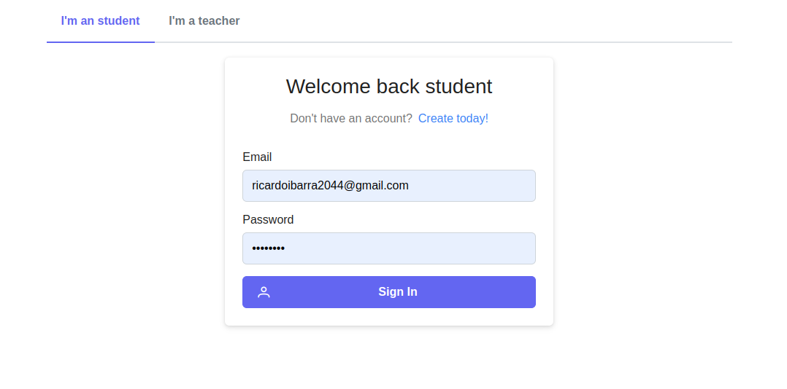
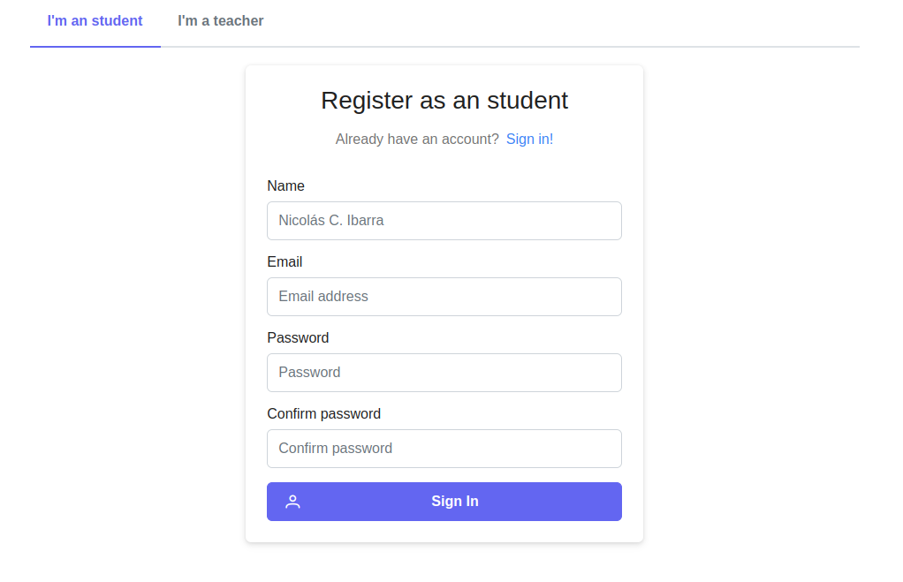
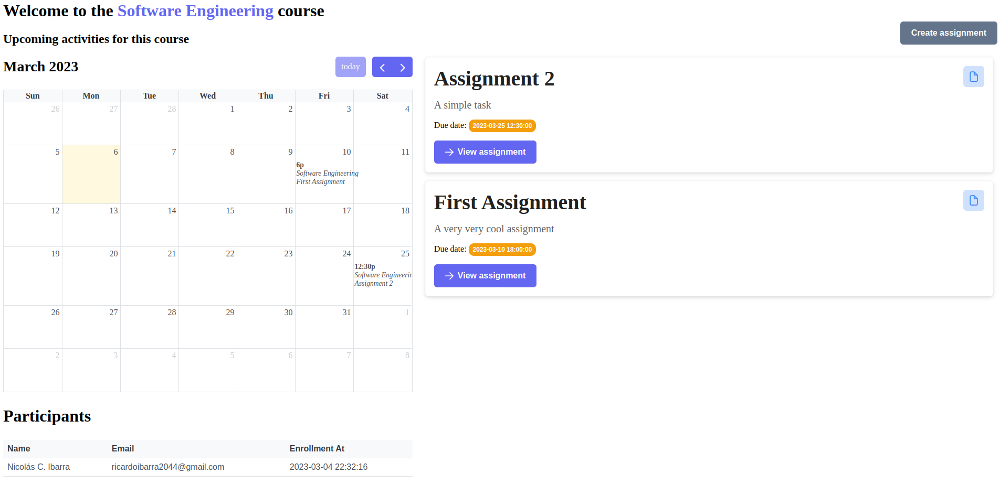

# About

This project aimed to be an imitation of the popular e-learning platform
*_Moodle_*, with a much simpler approach while still trying to maintain the core
essence of the original platform. In terms of functionality, this project
encompassed the following features:

- Enrollment of both students and teachers.
- Course creation.
- Assignment creation.
- Student enrollment in courses.
- Calendar for displaying assignments.
- Submissions with file upload.
- Assignment grading by teachers.

# Runtime

The project uses Payara Server 6 Community running on JDK 17.

# Installation

## Database (MySQL)

To start the database with docker, you can use the following command:

```bash
docker compose up --build
```

This will start a MySQL container with the database moodle_ripoff and a
PHPMyAdmin container for managing the database. PHPMyAdmin will be running on
port 80.

## Backend

To start the backend, you can use the following command:

```bash
mvn clean package payara-micro:start
```

Is important that the database is running before starting the backend.

## Frontend

To start the frontend, you need to have installed `node 18` and `yarn`:

```bash
cd src/frontend
yarn install
yarn dev
```

- The login will be available at http://localhost:3000/login
- The courses dashboard will be available at http://localhost:3000/courses
- A course dashboard will be available at http://localhost:3000/courses/:id

# Project structure

The project's backend is structured into 3 layers: repository, service, and web.

- **me.hikingcarrot7.moodleripoff.repository**: This layer is responsible for
  communication with the database. In this project, **MySQL** was used as the
  database.

- **me.hikingcarrot7.moodleripoff.service**: This layer is responsible for the
  business logic and communicates with the repository layer for accessing
  entities.

- **me.hikingcarrot7.moodleripoff.web**: This layer exposes services through a
  REST(less) API and communicates with the service layer. This layer also
  handles input validation using the `jakarta.validation` specification.
  Similarly, this layer is responsible for user authentication and
  authorization.

The project's frontend is located in the `src/frontend` folder and is built with
`React` and `Next.js`. Unfortunately, it could not be completed in time, but
a prototype was created that represents the project's intention. The frontend
consumes the API exposed by the web layer of the backend using `axios`.

## Login and Registration

The API is protected using JWT, so it is necessary to authenticate in order to
consume the services.

For simplicity's sake, it was decided that students and teachers would have
their own endpoints for login and registration. This was done to simplify data
validation and entity structure.

- For Students login, the `/auth/login/students` endpoint can be used. For
  student registration, the `/auth/register/students` endpoint can be used.

- Similarly, for Teachers login, the `/auth/login/professors` endpoint can be
  used. For teacher registration, the `/auth/register/professors` endpoint can
  be used.

The implementation of authentication and authorization was done using the
**Microprofile JWT** specification. The logic for token generation is done in
the **me.hikingcarrot7.moodleripoff.web.security.JWTTokenGenerator** class using
the private key found in the
**src/main/resources/META-INF/microprofile-config.properties**
file. [jwtenizr](https://github.com/AdamBien/jwtenizr) was used for generating
the private key.

## Students

The following features were implemented for students:

- Student login.
- Student registration.
- Retrieve student information.
- Update student information.

## Teachers

The following features were implemented for teachers:

- Authentication for teachers.
- Registration for teachers.
- Retrieval of teacher information.
- Updating of teacher information.

## Courses

The following features were implemented for courses:

- Teacher login.
- Teacher registration.
- Retrieve teacher information.
- Update teacher information.
- Course creation (only by teachers).
- Retrieve all courses a student is enrolled in.
- Retrieve all students enrolled in a course.
- Retrieve all courses created by the currently logged in teacher.
- Delete a course (only by the teacher who created it).

## Enrollments

For enrollments, the following functionalities were implemented:

- Enroll a student in a course using the course code (if the course has one).
- Unenroll a student from a course.

## Assignments

The following features were implemented for assignments:

- Retrieve all assignments for a course.
- Retrieve assignments for a student.
- Creation of assignments (exclusively for teachers).
- Updating of assignments (exclusively for teachers).
- Deletion of assignments (exclusively for teachers).

## Submissions

The following features were implemented for submissions:

- Students can submit their assignments along with a description and a file. The
  file is saved in `Cloudinary`, and its URL is stored in the database.
- Students can delete their submissions. This action also deletes the file from
  `Cloudinary`.
- The file submission is done using the class **me.hikingcarrot7.moodleripoff.service.FileUploaderService**. This class
  uses the `Cloudinary` API to upload the file and returns the URL of the
  uploaded file.

## Grades

The following features were implemented for grades:

- Teachers can grade student submissions. This action involves assigning a score
  or grade to the submission and providing feedback to the student.
- Teachers can delete grades for student submissions, if necessary. This could
  happen if there was an error in grading or if the grade was accidentally
  assigned to the wrong submission.
- Teachers can also delete the entire submission and grade if it violates any
  academic integrity policies or if it contains inappropriate content.

## Prototypes

> It is important to mention that these prototypes are not entirely functional.
> However, it was decided to leave them here so that you can get an idea of the
> intended construction.

The frontend progress can be found in the **src/frontend** folder.

### Login



### Register



### Dashboard (Student POV)


### Course with upcoming activities calendar (Student POV)


